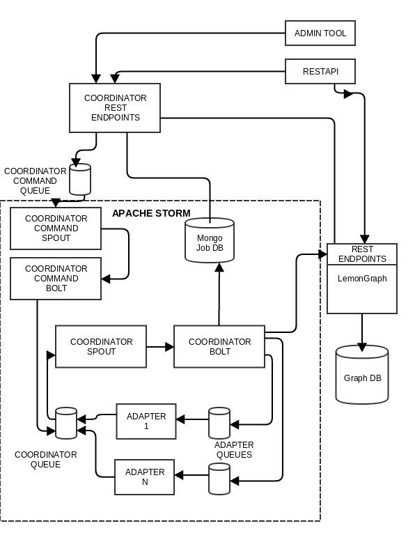
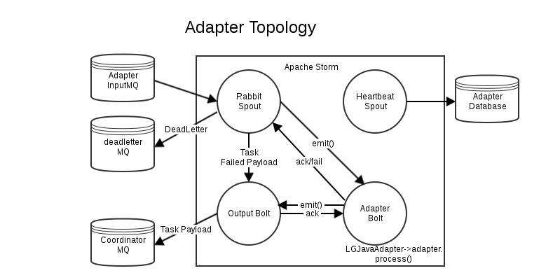

# LemonGrenade

LemonGrenade was designed as an automation system capable of smartly linking together systems, data sources, or capabilities - or combinations of such - without requiring the end-user manually specify linkages. The driving concept is let the data drive the dataflow; instead of a box-and-line workflow, the data and end-user intent drives a dynamic process without relying on process dependency lists.  LemonGrenade offers an alternative to precomputation of graphs, instead building graphs on demand from data sources or processes.  Use cases include iterative correlation and recursive file processing.



At its core, LemonGrenade ties one or more adapters together in a fluid framework.  These adapters receive tasking from controllers, which process jobs as submitted to the system.  Each job receives its own handling graph, to track processing stages and match data to adapters, as well as track new data inserted into the system through adapter returns.  The graph is implemented through LemonGraph, a custom graph library implemented for LemonGrenade; LemonGraph rides on top of (and inherits a lot of awesome from) Symas LMDB - a transactional key/value store that the OpenLDAP project developed to replace BerkeleyDB.  Job state is stored in MongoDB, and interacted with through a RestAPI.



LemonGrenade is customized with its adapters.  Example adapters are provided to show the framework for extending the base adapters.

This initial release is considered a Technical Preview and thus should not be considered stable in terms of functionality or APIs.

# Installation

LemonGrenade is supported for Linux only - tested under Centos 7 and Ubuntu 17.10.


```shell
# Packaged dependencies
if type -P apt-get > /dev/null; then
	# Ubuntu 17.10
	type -P curl > /dev/null || sudo apt install -y curl
	curl -LO https://github.com/rabbitmq/rabbitmq-server/releases/download/rabbitmq_v3_6_15/rabbitmq-server_3.6.15-1_all.deb
	sudo apt install -y \
		git make gcc g++ \
		maven openjdk-8-jdk \
		python-dev python-pip python-msgpack python-cffi \
		libffi-dev zlib1g-dev \
		supervisor \
		curl \
		./rabbitmq-server_3.6.15-1_all.deb
else
	# CentOS 7
	sudo yum install -y epel-release # for erlang
	sudo yum install -y \
		git make gcc gcc-c++ \
		maven java-devel \
		python-devel python2-pip python2-msgpack python-cffi \
		libffi-devel zlib-devel \
		supervisor \
		https://github.com/rabbitmq/rabbitmq-server/releases/download/rabbitmq_v3_6_15/rabbitmq-server-3.6.15-1.el7.noarch.rpm
	sudo systemctl enable rabbitmq-server
	sudo systemctl start rabbitmq-server
	sudo systemctl enable supervisord
	sudo systemctl start supervisord
fi

# Enable RabbitMQ Management plugin
sudo rabbitmq-plugins enable rabbitmq_management

# Python deps from PyPI for LemonGraph
(umask 0002; sudo pip install lazy python-dateutil pysigset)

# ZooKeeper
curl -LO https://archive.apache.org/dist/zookeeper/zookeeper-3.4.12/zookeeper-3.4.12.tar.gz
sudo tar zxf zookeeper-3.4.12.tar.gz -C /opt
sudo ln -nsf zookeeper-3.4.12 /opt/zookeeper

# Storm
curl -LO https://archive.apache.org/dist/storm/apache-storm-1.0.3/apache-storm-1.0.3.tar.gz
sudo tar zxf apache-storm-1.0.3.tar.gz -C /opt
sudo ln -nsf apache-storm-1.0.3 /opt/storm

# MongoDB
curl -LO https://fastdl.mongodb.org/linux/mongodb-linux-x86_64-3.2.20.tgz
sudo tar zxf mongodb-linux-x86_64-3.2.20.tgz -C /opt
sudo ln -nsf mongodb-linux-x86_64-3.2.20 /opt/mongodb

# Storm-RabbitMQ
(git clone https://github.com/ppat/storm-rabbitmq.git && cd storm-rabbitmq && git checkout 2586198306bd865f4f020d05899ef02bf397126c)

# LemonGraph
git clone https://github.com/NationalSecurityAgency/lemongraph.git
sudo ln -s "$PWD"/lemongraph /opt/

# LemonGrenade
git clone https://github.com/NationalSecurityAgency/lemongrenade.git
sudo ln -s "$PWD"/lemongrenade /opt/
```

# Build

```shell
# LemonGraph
make -C /opt/lemongraph test

# Storm-RabbitMQ
(cd storm-rabbitmq && mvn clean install)

# LemonGrenade
(cd /opt/lemongrenade && mvn -P deploy -DskipTests package)
```

# Setup

```shell
# Basic setup
sudo mkdir /data /data/log

# ZooKeeper - set `dataDir` to not be in /tmp
sed -r 's/^(dataDir=).*$/\1\/data\/zookeeper/' /opt/zookeeper/conf/zoo_sample.cfg \
	| sudo tee /opt/zookeeper/conf/zoo.cfg > /dev/null

# Storm
# In the conf, make sure you set ports for the supervisor daemon to use. You'll
# need one port for LemonGrenade itself and then an additional port per adapter
# you want to launch. None of these ports need to be exposed unless you're
# clustering storm. Memory usage can be configured based on your hardware.
sudo tee -a /opt/storm/conf/storm.yaml << EOF > /dev/null
supervisor.slots.ports:
  - 6700
  - 6701
  - 6702
  - 6703
  - 6704
  - 6705
  - 6706
  - 6707
  - 6708
  - 6709

supervisor.childopts: "-Xmx256m"
worker.childopts: "-Xmx256m"
storm.workers.artifacts.dir: "/data/logs/"
storm.zookeeper.servers: ["localhost"]
nimbus.seeds: ["localhost"]
ui.host: "localhost"
topology.spout.wait.strategy: "org.apache.storm.spout.SleepSpoutWaitStrategy"
topology.sleep.spout.wait.strategy.time.ms: 1000
EOF

# Mongo
sudo mkdir /data/mongo

# LemongGraph
sudo mkdir /data/lemongraph

# LemonGrenade
cp /opt/lemongrenade/core/resources/certs.example.json     /opt/lemongrenade/conf/certs.json
cp /opt/lemongrenade/core/resources/LGAdapter.example.json /opt/lemongrenade/conf/LGAdapter.json
cp /opt/lemongrenade/conf/lemongrenade.example.props       /opt/lemongrenade/conf/lemongrenade.props

# Supervisor
for x in ini:/etc/supervisord.d conf:/etc/supervisor/conf.d; do

sdir="${x#*:}"
suffix="${x%:*}"

[ -d "$sdir" ] || continue

sudo tee "$sdir/zookeeper.$suffix" <<- EOF > /dev/null
[program:zookeeper]
user=root
command=/opt/zookeeper/bin/zkServer.sh start-foreground
redirect_stderr=true
stdout_logfile=/data/log/zk-supervisor.log
EOF

sudo tee "$sdir/storm.$suffix" <<- EOF > /dev/null
[program:storm-nimbus]
user=root
directory=/opt/storm
command=/opt/storm/bin/storm nimbus
redirect_stderr=true
stdout_logfile=/data/log/nimbus-supervisor.log

[program:storm-supervisor]
user=root
directory=/opt/storm
command=/opt/storm/bin/storm supervisor
redirect_stderr=true
stdout_logfile=/data/log/supervisor-supervisor.log

[program:storm-ui]
user=root
directory=/opt/storm
command=/opt/storm/bin/storm ui
redirect_stderr=true
stdout_logfile=/data/log/ui-supervisor.log

[program:storm-logviewer]
user=root
directory=/opt/storm
command=/opt/storm/bin/storm logviewer
redirect_stderr=true
stdout_logfile=/data/log/logviewer-supervisor.log
EOF

sudo tee "$sdir/mongo.$suffix" <<- EOF > /dev/null
[program:mongod]
user=root
directory=/opt/mongodb
command=/opt/mongodb/bin/mongod --maxConns 10000 --dbpath /data/mongo
redirect_stderr=true
stdout_logfile=/data/log/mongod.log
EOF

sudo tee "$sdir/lemongraph.$suffix" <<- EOF > /dev/null
[program:lemongraph]
user=root
directory=/opt/lemongraph
command=python -mLemonGraph.server -s -p 8001 /data/lemongraph/graphs
redirect_stderr=true
stdout_logfile=/data/log/lemongraph-supervisor.log
EOF

sudo tee "$sdir/lemongrenade.$suffix" <<- EOF > /dev/null
[program:lemongrenade-api]
user=root
directory=/opt/lemongrenade
command=java -jar /opt/lemongrenade/webapp/webapp-latest-jar-with-dependencies.jar
redirect_stderr=true
stdout_logfile=/data/log/lemongrenade-api-supervisor.log
EOF

break

done
```

# Launch

Launch all of the things (except RabbitMQ) under supervisord:

```shell
sudo supervisorctl update
```

# Storm Topologies

Once storm is up, launch the coordinator and any additional storm topologies

```shell
/opt/storm/bin/storm jar /opt/lemongrenade/core/core-latest-jar-with-dependencies.jar CoordinatorTopology 00000000-0000-0000-0000-000000000000
```

# License

LemonGrenade is released under the Apache 2.0 license.

# Misc

Redeploy latest adapters to storm:
- Kill currently running topologies:
  - `sudo bash lemongrenade/dev/kill_topologies.sh`
- Launch topologies
  - `sudo bash lemongrenade/dev/launch_topologies.sh`

UI Endpoints:
- Storm: localhost:8080 - Will use HTTPS if defined in storm.yaml, else HTTP. Storm interface. View all running topologies with links to logs of all adapter output.
- LemonGrenade Lemonview: localhost:9999 Information on running adapters, jobs, statuses, and other metrics.
- LemonGrenade API localhost:9999/api
- RabbitMQ localhost:15672
- Admin interface to RabbitMQ. View messages being processed by each adapter/coordinator queue.
- Lemongraph: localhost:8001/graph Alternatively available as a lemongrenade passthrough via localhost:9999/lemongraph/graph . Lookup information on all graph transactions.

Common Errors:
- "Can't find file certs.json" - Copy the `certs.example.json` file to `/opt/lemongrenade/conf/certs.json` and populate the values in certs.json to indicate the correct values for your system.
- Zookeeper fails to communicate with nimbus. The storm UI on port 8080 will show an error message. Check nimbus logs for solution.
