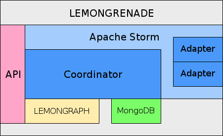

## LG External API docs (WIP)

### Introduction

   LG details along the lines of:
- Batch automation framework
* Data-driven
* Iterative
* One graph per job
- Adapters
* Subscribe to graph patterns
* Receive node/edge tuples
* Drive external capabilities
* Stream results into graph
- Jobs
* Job parameters
* Initial graph data
- REST API
* No stock user interface
- Open Source

<dl>
  <dt>Endpoint List</dt>
    <dd>Get Jobs</dd>
    <dd>Get Job by job_id</dd>
    <dd>Get Seed information by job_id</dd>
    <dd>Get Job config info by job_id</dd>
    <dd>Get Node info by job_id and node_id</dd>
    <dd>Get Seed info by job_id and seed_id</dd>
    <dd>Add User to job by job_id</dd>
    <dd>Get list of current active jobs</dd>
    <dd>Get Status of job by job_id</dd>
    <dd>Get History of job by job_id</dd>
    <dd>Get list of current Adapters</dd>
    <dd>Get Adapter information by adapter_id</dd>
    <dd>Create Job</dd>
    <dd>Add data to current existing job by job_id</dd>
    <dd>Activate specific adapter for additional actions by job_id</dd>
    <dd>Cancel all tasks associated with job(s)</dd>
    <dd>Delete job</dd>
    <dd>Reset job to pre-processing structure</dd>
</dl>

----
##### Get Jobs
- URL:
  * /jobs/
- Method:
  * GET
- URL Params:
  * Optional:
    user=$user
- Data Params:
  * N/A
- Success Response:

----
##### Get Job by job_id
- URL:
  * /job/$job_id
- Method:
  * GET
- URL Params:
- Data Params:
  * N/A
- Success Response:
{
    "job_id": "00000000",
    "config": {
        "description": "job descripion",
        "created": "2016-07-07T06:14:09.725056Z",
        "priority": "user_low",
        "depth": 4,
        "ttl": 0,
        "adapters": {}
    },
    "nodes": [],
    "edges": [],
    "maxID": 6,
    "size": 40960,
    "reason": "",
    "status": "NEW",
    "errors": []
}

----
##### Get Seed information by job_id
- URL:
  * /seeds/$job_id/
- Method:
  * GET
- URL Params:
- Data Params:
  * N/A
- Success Response:

----
##### Get Job config info by job_id
- URL:
  * /job/$job_id
- Method:
  * GET
- URL Params:
- Data Params:
  * N/A
- Success Response:
{
    "job_id": "047fc846-440a-11e6-8771-ecf4bbc18ed4",
    "config": {
        "description": "job descripion",
        "created": "2016-07-07T06:14:09.725056Z",
        "priority": "user_low",
        "depth": 4,
        "ttl": 0,
        "adapters": {}
    },
    "maxID": 6,
    "size": 40960,
    "reason": "",
    "status": "NEW",
    "errors": []
}

----
##### Get Node info by job_id and node_id
- URL:
  * /job/$job_id/node/$node_id/
- Method:
  * GET
- URL Params:
- Data Params:
  * N/A
- Success Response:

----
##### Get Edge info by job_id and edge_id
- URL:
  * /job/$job_id/edge/$edge_id/
- Method:
  * GET
- URL Params:
- Data Params:
  * N/A
- Success Response:

----
##### Add User to job by job_id
- URL:
  * /user/$job_id/add
- Method:
  * PUT
- URL Params:
- Data Params:
  * N/A
- Success Response:

----
##### Get list of current active jobs
- URL:
  * /active/
- Method:
  * GET
- URL Params:
- Data Params:
  * N/A
- Success Response:

----
##### Get Status of job by job_id
- URL:
  * /job/$job_id
- Method:
  * GET
- URL Params:
- Data Params:
  * N/A
- Success Response:
{
    "reason": "",
    "status": "NEW"
}

----
##### Get History of job by job_id
- URL:
  * /job/$job_id
- Method:
  * GET
- URL Params:
- Data Params:
  * N/A
- Success Response:
{
    "history": [
        {
            "commandtype": 2,
            "enddate": "Jul 07,2016 06:14:09",
            "graph_changes": 0,
            "current_id": 0,
            "number_of_new_tasks_generated": 0,
            "graph_max_id": 0,
            "task_id": "",
            "message": "No valid adapters for job",
            "startdate": "Jul 07,2016 06:14:09",
            "command": "error"
        }
    ]
}

----
##### Get list of current Adapters
- URL:
  * /job/$job_id
- Method:
  * GET
- URL Params:
- Data Params:
  * N/A
- Success Response:

----
##### Get Adapter information by adapter_id
- URL:
  * /job/$job_id
- Method:
  * GET
- URL Params:
- Data Params:
  * N/A
- Success Response:

----
##### Create Job
- URL:
  * /create
- Method:
  * POST
- URL Params:
- Data Params:
  * N/A
- Success Response:
  * {"job_id": "047fc846-440a-11e6-8771-ecf4bbc18ed4",
    "status": "created"}
- Error Response:
- Sample Call:
$.ajax({
  url:"/create",
  type:"POST",
  })

----
##### Add data to current existing job by job_id
- URL:
  * /add/$job_id
- Method:
  * POST
- URL Params:
- Data Params:
  * N/A
- Success Response:
- Error Response:
- Sample Call:

----
##### Activate specific adapter for additional actions by job_id
- URL:
  * /useadapter/$adapter_id
- Method:
  * POST
- URL Params:
- Data Params:
  * N/A
- Success Response:
- Error Response:
- Sample Call:

----
##### Cancel all tasks associated with job(s)
- URL:
  * /cancel
- Method:
  * PUT
- URL Params:
- Data Params:
  * N/A
- Success Response:
- Error Response:
- Sample Call:

----
##### Delete job
- URL:
  * /delete
- Method:
  * POST
- URL Params:
- Data Params:
  * N/A
- Success Response:
- Error Response:
- Sample Call:

----
##### Reset job to pre-processing structure
- URL:
  * /reset
- Method:
  * POST
- URL Params:
- Data Params:
  * N/A
- Success Response:
- Error Response:
- Sample Call:
